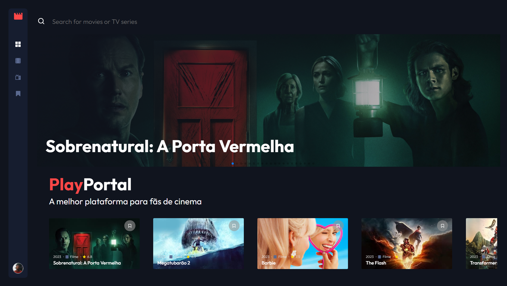
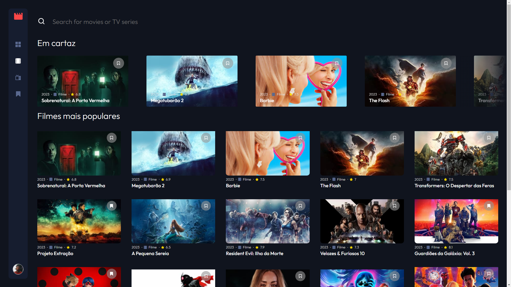
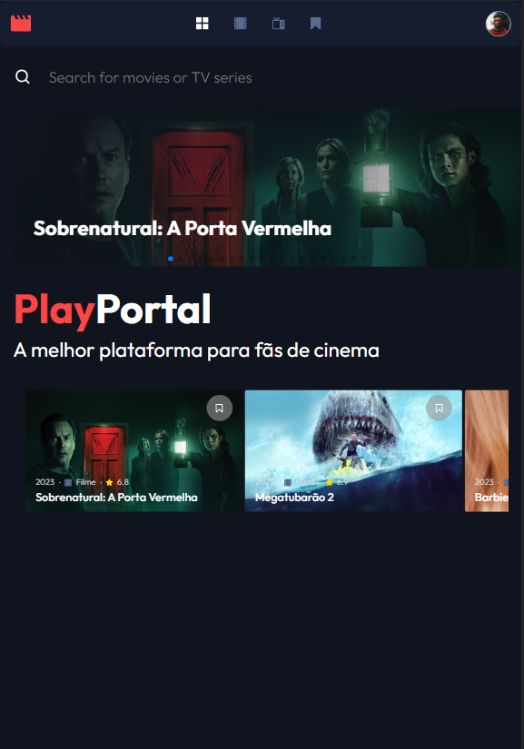
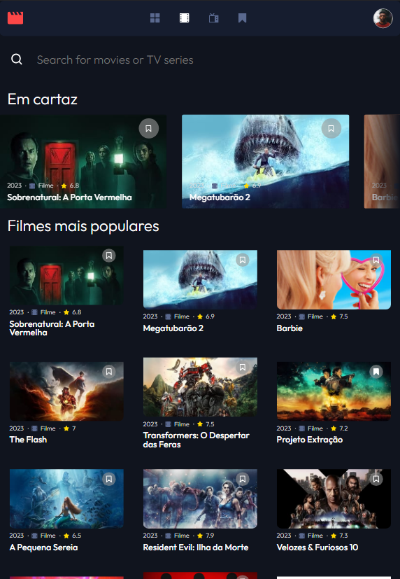
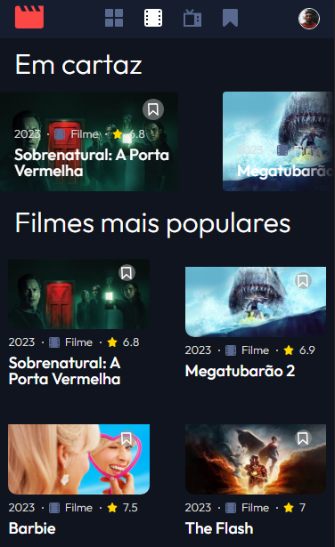

# PlayPortal

O PlayPortal é um website desenvolvido com React que utiliza a API do TMDb para exibir os principais filmes e séries. Os usuários podem visualizar informações detalhadas sobre os programas, conferir os shows em lançamento, descobrir quais filmes e séries estão mais populares e salvar seus programas favoritos. Além disso, oferece um carrossel com os filmes em cartaz, proporcionando uma experiência dinâmica. O projeto foi concebido com o objetivo de aplicar os conhecimentos adquiridos em React e proporcionar aos usuários uma plataforma prática e intuitiva para explorar o mundo do entretenimento online.

É possível ver o site em funcionamento ao visitar https://play-portal.vercel.app

## Tecnologias

Essas foram as tecnologias usadas no projeto:

- React
- JavaScript
- HTML5
- CSS3

## Aprendizado

Com o desenvolvimento desse projeto, pude colocar em prática conceitos essenciais do desenvolvimento em React, como estado, componentes, hooks e como utilizar a biblioteca React Router Dom para criar Single Page Applications.

## Features

- Exibir filmes e séries em cartaz
- Exibir filmes e séries mais populares no momento
- Busca pelo nome do filme
- Visualizar dados avançados do filme
- Salvar filmes como favoritos
- Carousel com filmes e séries em cartaz

## Layout

### Desktop

### Tablet

### Mobile

## Links

- LinkedIn: https://www.linkedin.com/in/gabrielayresdev/
- Repositório: https://github.com/gabrielayresdev/PlayPortal
  - Caso encontre algum bug e deseje reportar, favor, enviar email para gabriel.ar.fort@gmail.com
- Deploy: https://play-portal.vercel.app
